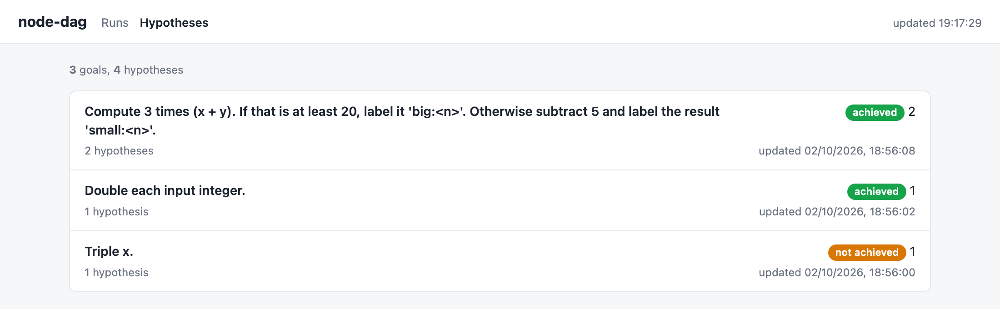
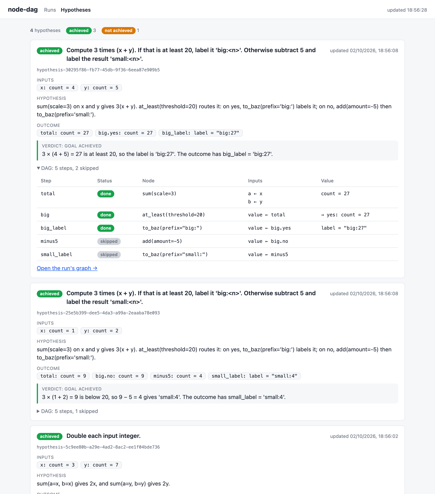
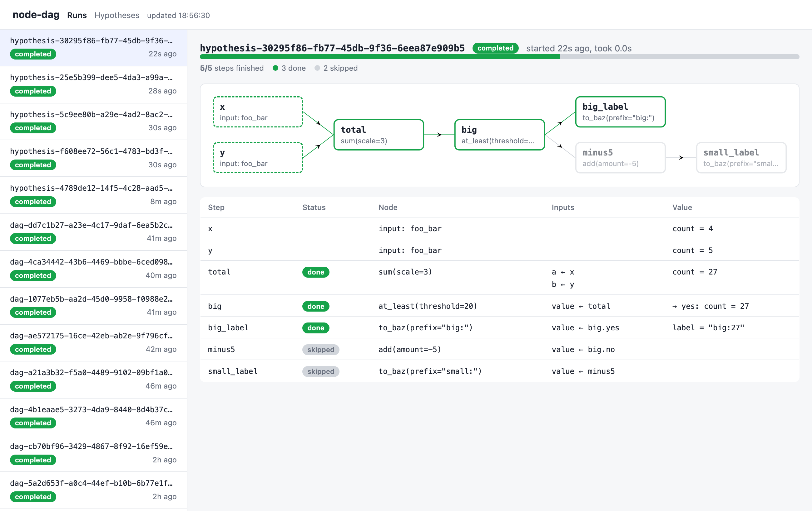

# hypothesis

A domain-specific agent that explores hypotheses by composing reproducible workflows
from a collection of tools, scorers and filters.

You give it a goal and some inputs. A builder agent writes a hypothesis (how a DAG of
the available nodes can meet the goal) and the DAG itself. The DAG runs as a Temporal
workflow, and a verifier agent reviews the outcome. Code decides whether the goal was
met, and the verifier can only veto.

Contributor guidance lives in [AGENTS.md](AGENTS.md). The proposed recoding
experiment, possible research directions and implementation priorities are in
[docs/research-directions.md](docs/research-directions.md). The tentative agent
and workflow architecture is in [docs/intended-structure.md](docs/intended-structure.md).

- **Reproducible.** A DAG is plain JSON over typed nodes, checked before it runs. The
  same DAG on the same inputs gives the same result.
- **Cached.** Each node's result is cached by its config and inputs, so a step that
  already ran is never computed again, even in a different DAG.
- **Scalable.** Runs are Temporal workflows. Steps that are ready together run in
  parallel, and you add workers to run more.

Every goal, and how many of its hypotheses met it:



Open a goal to list its hypotheses, then a hypothesis for its DAG, outcome and
verdict:



Each run, with the status of every step:



## Layout

```
src/node_dag/
  types.py                     entities (Dna, Rna, AminoAcidSequence, ProteinStructure, ProteinContacts, StructureAlignment) with an id, Score, Table, TYPES
  dna.py                       genetic code, synonymous codons, atoms per base
  nodes/base.py                Category, BaseToolConfig, BaseScoreConfig, BaseFilterConfig, BaseNode
  nodes/tools/<name>/          config.py + function.py; tools make entities, scorers score them
  nodes/filters/<name>/        config.py + function.py; run returns a bool for each entity
  factory.py                   NodeConfig union + config -> node class mapping
  dag.py                       Dag / Step; rejects cycles, unknown sources, type and score column mismatches
  plan.py                      Plan, ToolRequest, Assertion, accepted(): the acceptance rule
  agent.py                     Hypothesis; the inputs, criteria, builder, verifier and critique agents
temporal/
  dag/workflow.py              DagWorkflow: runs each step on its whole table once it exists
  dag/activities.py            run_tool, run_score, run_filter (call the factory), save_workflow
  hypothesis/                  HypothesisLoop and its model-call activities
  ui/                          web pages for the runs and the hypotheses
  run_worker.py                the Temporal worker
  run_workflow.py              run a DagInput JSON file
  run_hypothesis.py            run a Hypothesis JSON file through the loop
  run_ui.py                    serve the web pages
  scaffold_node.py             write a requested node's package, all but run()
  pulse.py                     what changed in the open runs since the last look
  ledger.py                    one line per finished run, read the way pulse reads it
  run_benchmark.py             compare recoding strategies on fixed genes (node_dag/benchmark.py); no Temporal
```

## Nodes

A DAG works like Pipeline Pilot or KNIME. You pass in a list of entities for each
input, and each node runs once on the whole list that reaches it. An entity (`Dna`, `Rna`,
`AminoAcidSequence`, `ProteinStructure`, `ProteinContacts`, `StructureAlignment`) has an `id`: a hash of its kind and sequence, so the same
sequence always has the same id and identical entities merge into one.

What flows along an edge is a `Table`: the entities, and their scores so far as
columns keyed by entity id. A column is named `<node name>__<config hash>__<score name>`.

A config declares the node's contract as ClassVars:

- `inputs`: the one port name -> entity type. `run` takes the list of entities by that
  name: `run(sequence=[Dna, ...])`.
- `categories`: what the node does.

There are three kinds of node:

- **Tool** (`BaseToolConfig`): `output` is the entity type. `run` returns the new
  entities, which replace the old and have no scores.
- **Scorer** (`BaseScoreConfig`): `output` maps each score name to `Score`, like
  `{"expression": Score}`. `run` returns one `{score name: Score}` dict per entity. The
  entities pass through, with a column added for each score.
- **Filter** (`BaseFilterConfig`): has a `column`. `run(items, values)` gets the
  entities and that column's values and returns a bool for each (`pareto_front` weighs
  several columns, `objectives`, and gets `values` as a dict keyed by column). The
  entities that get True go to `<step>.yes`, the rest to `<step>.no`, both with their
  scores. The filters are `at_least`, `at_most`, `top_k`, `pareto_front` and
  `beats_reference`.

`beats_reference` is for a goal like "keep the ones that score higher than the first
sequence". Use it instead of a typed threshold (`at_least`, `at_most`), which would have to be
copied from an earlier round: the baseline is measured in the run. `reference` is the
entity, `scored_in` is the step whose table holds that entity's score in
`column`, and the filter keeps the entities that score strictly above it, or strictly
below it with `higher` false. The reference itself only ties, so it goes to `.no`.
Score the reference with the same node as the entities, for example in a second scoring
step on the DAG input. `run` then gets that score as `reference`, after `items` and
`values`.

Every config has a `config_hash`: a hash of its name, version and fields, set when the
config is made. A config with a different hash is rejected, so leave it out. Two scorers
with different fields (say, a different UTR) make different columns. Because the
DAG is checked before it runs, a filter on a column that nothing upstream makes is an
error that lists the columns it could have used.

A test checks that `inputs` matches `run`'s signature and that `categories` is set.

To add a node, write `config.py` and `function.py`, then add the config to
`NodeConfig` and `MAPPING` in `factory.py`. To add an entity type, add it to
`Value` and `TYPES` in `types.py`.

## DAGs

```json
{
  "inputs": {"seqs": "dna"},
  "steps": {
    "mutated": {"config": {"name": "mutate_synonymous", "seed": 1, "count": 2}, "inputs": {"sequence": "seqs"}},
    "scored":  {"config": {"name": "ostir_expression", "utr": "TTCTAGAAAGGAGGTAAAAAA"},
                "inputs": {"sequence": "mutated"}},
    "expressed": {"config": {"name": "at_least", "column": "ostir_expression__1463740e__expression", "threshold": 100000},
                "inputs": {"items": "scored"}}
  }
}
```

A source is a DAG input, a tool or scoring step, or a filter branch. A step runs once
its source has a table, and is skipped if the table is empty. A `beats_reference` step also
waits for the step its `scored_in` names. The DAG is rejected if that step's table cannot
hold `column`, and the run fails if the table has no score for the reference. Steps that
are ready at the same time run in parallel. `examples/simple.json` is a full run.

Results go under `$NODE_DAG_RESULTS` (default `results/`):

- `nodes/<node name>/<hash>.json`: each node's cached result, keyed by its config and inputs.
- `workflows/<workflow id>.json`: each run's DAG, step statuses and tables (entities and
  score columns), written when the run finishes or fails. The save gets three attempts. If
  all fail, the workflow logs `The run was not saved` and the run still ends as it would
  have, with its result or the failing step's error, but no file.
- `registry/<node id>.json`: each node a builder agent made, with its description.
- `hypotheses/<hypothesis id>.json`: each Hypothesis, saved after each stage of the loop.
  The loop's workflow ID is the hypothesis ID; each round's DAG runs as `<hypothesis id>-r<round>`.
- `requests/<node name>.json`: each node a plan asked for that does not exist yet.

```bash
uv sync
uv run pytest
temporal server start-dev &
uv run python -m temporal.run_worker
```

## UI

`temporal.run_ui` serves a page at http://127.0.0.1:8000 that lists the DagWorkflow
runs and draws the selected run's DAG with [nice-dag](https://github.com/eBay/nice-dag).
Each step shows its status: pending, running, done, skipped or failed. A finished run is
read from `results/workflows/`, which needs neither Temporal nor a worker. For a run
with no file, the page reads the workflow's `progress` query every 2 seconds, so a worker must be
running to answer it. `run_worker --step-delay` makes each step sleep first, so you can watch
a run progress.

A run has two views, switched at the top and kept in the URL (`?run=…&view=table`).
**Table** is every sequence the run touched as rows (its `id`, kind and display string,
which for DNA is the codons spaced out) by one column per score, named by score, node and
config hash. **Graph** is the DAG. Click a node and the panel below it shows either
**Sequences × scores** or **Config & inputs**, chosen by a toggle. For sequences: an
input or a tool shows the sequences in and out, a scorer shows its inputs with the score
columns it added, and a filter shows every input row as kept or filtered out, with the
column it filters on highlighted. Config & inputs shows the node's name, `config_hash` and
fields, what feeds each port, and what the step produced. Deselect with the button, Esc or
a click on nothing.

A row for an entity that carries a structure, such as the `ProteinStructure` an
`esmfold2_fold` step makes, has a **View** button in both views. It opens that
structure full screen in [Mol*](https://molstar.org), which you close with the button
or Esc. Mol* is 5 MB, so the page fetches it the first time you ask for a structure,
not on load. The structures themselves come down with the run, so a run that folded a
lot of sequences makes for a big `progress` response.

http://127.0.0.1:8000/hypotheses lists every goal with a count of its hypotheses by
status. It is one page: open a goal to list its hypotheses, each a line with its
status and a summary, and open a hypothesis for the rest of it. What a hypothesis holds
sits behind a section you open as you want it: each criterion marked met, not met or
unclear by the assertions that covered it, every round, the outcome and verdict, its DAG
step by step, and a link to its run. A blocked one has Resume and Abandon buttons.
Opening the Record under an observation fetches that Amass record, which is the only
part of the page that leaves disk. It otherwise reads the files under `results/`, so it
needs no worker.

http://127.0.0.1:8000/new starts a hypothesis: enter a goal, and open a section for
anything else you want to set — your own hypothesis for how to meet it, criteria (rows of
a kind, quantitative or qualitative, and a claim, or drafted by the criteria agent through
`POST /api/criteria` for you to edit), the observations to build on, and a cap on the
rounds. The form takes words only: an agent reads the entities the goal gives out of its
text before round 1, and `POST /api/hypotheses` still takes `inputs` for a caller who has
them. The server then starts the loop in the background, and the page jumps to the
hypothesis so you can watch its rounds. This needs a worker running. Inputs that cannot
run, an empty list or a list of mixed kinds, get a 422 and nothing is saved. If the
workflow cannot be started (Temporal is down, say), the saved hypothesis ends as `failed`
with that reason and the server answers 503. `--model` and `--verify-model` on `run_ui`
default to `anthropic:claude-sonnet-5-5` to build and `anthropic:claude-haiku-4-5` to
verify; [The loop](#the-loop) says which calls each covers.

Nothing fetches an input. `add_input` takes entities as objects, so any kind in `TYPES`
can be an input — a DNA or RNA sequence, a protein sequence, a structure, a set of
contacts — and the goal or the proposed hypothesis has to carry the value. An entity the
model wrote out rather than was given is unverified; `input_sources` records what each
input was taken from, and is the only provenance a run carries.

http://127.0.0.1:8000/nodes lists every node in the registry, as the builder agent sees
it: its description, input port, outputs, the full name of each score column a scorer
adds, the column a filter reads, and its config. Above them, the nodes that plans have requested
and how many runs are blocked on each. It has a search box, and reads the
files under `results/registry/`, so it needs no worker and updates as agents register
nodes.

Models use the Anthropic API directly, so set `ANTHROPIC_API_KEY` first.

```bash
export ANTHROPIC_API_KEY=sk-ant-...
temporal server start-dev &
uv run python -m temporal.run_worker --step-delay 2 &
uv run python -m temporal.run_ui &
uv run python -m temporal.run_workflow examples/simple.json
```

### Make commands

The `Makefile` runs the server, worker and UI in the background:

- `make start`: start the Temporal dev server if it isn't running, then the worker and
  the UI.
- `make stop`: stop the worker, the UI and the Temporal server. `make start` runs the
  server with `--db-filename results/temporal.db`, so its history survives a restart; a
  bare `temporal server start-dev` holds its runs in memory.
- `make restart`: stop everything, then start it again. Run it after you change code.
- `make logs`: follow the worker and UI logs.

`make start` prints the URLs: the UI at http://127.0.0.1:8000 and the Temporal UI at
http://localhost:8233. Logs go to `results/logs/` (`temporal.log`, `worker.log`,
`ui.log`). The UI builds with
`anthropic:claude-sonnet-5-5` and verifies with `anthropic:claude-haiku-4-5` by default.
Pick another build model with `MODEL`, as in `make restart MODEL=anthropic:claude-opus-5-5`.

### Evaluating the UI with Claude

`.mcp.json` adds the [Playwright MCP server](https://github.com/microsoft/playwright-mcp),
so Claude Code can drive the UI in a browser. With the UI running, open Claude Code in
this repo, approve the `playwright` server, and ask it something like "Open
http://127.0.0.1:8000/hypotheses, click through a goal and a hypothesis, and report
anything broken or confusing". It reads the page's accessibility tree, clicks, fills in
forms, reads console errors and takes screenshots. Screenshots go to
`results/playwright/`. Each session starts with a fresh browser profile (`--isolated`).
It needs Node (`npx`) and Chrome.

## The loop

A `Hypothesis` holds a `goal`, the `inputs` to run it on (a list of entities per input
name, as in `examples/optimise.json`) and optional `criteria`: claims the result must
satisfy. `HypothesisLoop` (`temporal/hypothesis/`) runs it as a durable Temporal
workflow. Only the model calls are non-deterministic, and each is an activity:

1. **Inputs.** If you gave none, an agent reads the entities the goal names out of its
   text — any kind in `TYPES`, not only DNA — and freezes them on the Hypothesis, with
   where each came from. It has no database: a goal that names something without giving
   its value gets no input for it. Inputs you give are used as they are, and are never
   changed mid-run.
2. **Criteria.** If you gave none, an agent derives them from the goal. They are frozen.
   Each is an `id`, a `claim` and a `source`: `human` if it came from you (the new-hypothesis page sends every criterion as `human`), else `derived`.
3. **Plan.** The builder agent makes the nodes it needs (`create_node`), reuses
   registered ones, and submits a `Plan`: the wiring, plus at least one assertion for each
   criterion saying what its step settles: on a filter, `yes` (every entity passed) or `no`
   (every entity failed), or `produced` (it kept at least one, and may have dropped the
   rest, as choosing the best of a pool does); on any other step, `produced` (it gave
   output). Guards reject a bad plan before anything runs, and the agent fixes it. Among
   them: inputs that are not the goal's; a step whose node or config does not exist, does
   not fit or does not type-check; a `beats_reference` reference that is not one of the
   inputs, or whose `scored_in` step never reads the input that holds it; an assertion
   on a criterion or step that is not there, or `yes` or `no` on a step that is not a
   filter; `yes` with `no`, or `no` with `produced`, on one filter; a criterion no
   assertion covers; a wiring an earlier round already ran; and, after a critique, a
   plan that does not say what it changes.
   The builder can also search the literature with Amass (`search_literature`,
   `get_record`; set `AMASS_API_KEY`), and cites each record it used as an observation
   on the plan. Those of the current round's plan are on the Hypothesis as
   `observations`, which the hypothesis, goal and Observations pages show.
4. **Run.** The plan becomes a `Dag` and runs as the `DagWorkflow` child.
5. **Verify.** A second agent reads the outcome and can only veto.
6. **Critique.** If the round failed, a third agent says why. The next plan must address it.

Each model call writes its full message history, failed calls included, to
`results/trajectories/<hypothesis id>-r<round>-<stage>.json` (`criteria` and `inputs` are round 0). That is
where to look for which nodes the builder read and which guard it bounced off.

Rounds stop at `max_rounds` (default 20; `--max-rounds` on `run_hypothesis`) or 500,000 tokens, whichever comes first.
A round has cost a median of 115,000 tokens, and the ceiling is checked before each round, so a run usually stops after
about five rounds, the last one crossing it. Both limits are saved on the Hypothesis, and the hypotheses page shows
"round N of M" and the tokens spent. The stop reason is `stopped_because`, and every round is kept in `attempts`.

**Models.** `run_hypothesis` and `run_ui` take `--model` for the builder, which also makes the
inputs, criteria and critique calls (and the UI's criteria drafting), and `--verify-model` for
the verifier alone. Both are optional: the defaults are `anthropic:claude-sonnet-5-5` and
`anthropic:claude-haiku-4-5`. The verifier is a different model on purpose, so that a blind
spot it shares with the builder does not pass every round. Nothing checks that the two differ;
the help text only asks you to keep them so.

**Acceptance is code, not a model.** `accepted()` in `plan.py` passes a round only if
every criterion has an assertion, every assertion holds on the outcome, and the verifier
both agrees (`agrees`) and judges the assertions to cover the goal (`covers_goal`). A `yes` or
`no` assertion holds only if that branch took at least one entity and the other took none, so
one plan cannot assert both branches of a filter. A `produced` assertion holds when the step,
or a filter's `yes` branch, gave at least one entity. On a filter it never covers a criterion
about what the kept entities hold, such as every kept sequence beating the first: the builder
is told to hold that with `yes` on a second filter over the first's `yes` branch, and the
verifier to set `covers_goal` false when only `produced` backs it. The verifier and the critic
are shown what each node in the DAG says it does. A model cannot grant acceptance, only veto it.
A model that refuses a call stops the run with the refusal as the reason.

**Blocked on a tool.** Off by default: a plan carrying `requests` is sent back to the
builder to compose from the nodes that exist, since a guard the builder cannot satisfy
otherwise turns into a request for a node that was never needed. Start the run with
`--allow-requests` (or `allow_requests` in `POST /api/hypotheses`) to allow one.

With it on, a plan may request at most three nodes that do not exist yet, with
a contract (purpose, ports, example) and why none can be composed from the registry. It
type-checks against stand-ins, saves the request under `results/requests/`, and the run
shows `blocked`. `uv run python -m temporal.scaffold_node <name>` writes the node's
`config.py` and `function.py` from the request, with the same ports, fields and config hash
the plan was checked against, and prints the `factory.py` edits. Write `run()`, make the
edits, restart the worker, and click Resume on the nodes page (or POST
`/api/hypotheses/<id>/tool_added`); the same plan is resolved again without a new model
call. `abandon` ends it. `examples/recode_acg_mock.json` is a synthetic gene with two ORFs in
different frames, which no registered node can recode in both, so it is meant to block in round 1
when it is run with `--allow-requests`.

**Watching runs.** `uv run python -m temporal.pulse` prints a status line per open run, and on
every later look what moved since the last: criteria fixed, a round opened, a plan accepted,
blocked, the verdict. It warns about a model call sent back three or more times (and says what
for), a run blocked for a long time, and a budget nearly spent. For a blocked run it says what
each requested node still needs. It only reads files; `--every 30` keeps looking, and `--json`
prints the look for another program. Readings are kept in `results/pulse.json`. `AGENTS.md` says what each alert means and what to do.

**Ledger.** Every run that ends adds one line to `results/ledger.jsonl`: its goal, how and why it
ended, the rounds and what held in each, tokens and seconds, guard retries, errors and repeated
wirings, the nodes it used and asked for, and the model per stage. The values are read from the
saved files the way `pulse` reads them, with no model involved. List it with
`jq -r '[.ended[:16], .hypothesis, .state, .rounds, .tokens, .summary] | @tsv' results/ledger.jsonl`.

**Cache warning.** Node results are cached by config and inputs. If you change what a
node does, bump its `version` (`scaffold_node <name> --bump`), or old results are served.

```bash
# Start the server
temporal server start-dev
# Start the worker
uv run python -m temporal.run_worker
# Start the UI
uv run python -m temporal.run_ui
```

Or run `make start` to start all three. See [Make commands](#make-commands).

## Nodes/tools

We have $150 in Modal credits. You can use these inside a node to run on larger machines or on GPUs.

We also have $20 of HuggingFace Jobs, which is pretty similar.

### GPU nodes on Modal

`esmfold2_fold` takes amino acid sequences and gives a `ProteinStructure` for each: the
sequence and its predicted structure as an mmCIF string. It folds each sequence as a
monomer with [ESMFold2-Fast](https://huggingface.co/biohub/ESMFold2-Fast), the
single-sequence model, on one L40S on Modal. With `as_complex` the step instead folds
every sequence that reaches it together as one complex on
[ESMFold2](https://huggingface.co/biohub/ESMFold2), the full model that conditions the
chains on each other, and returns that one structure instead of one per sequence:
chains are lettered in arrival order, and the entity's `sequence` is the chains
concatenated in that order. Protein chains only — no nucleic acid or ligand — and a
homodimer cannot be asked for, since identical entities are merged before the step.

The GPU work lives in `nodes/tools/esmfold2_fold/modal_app.py`: the image, the volume
that caches the Hugging Face weights between cold starts, and the `fold` function. The
node calls it with `app.run()`, so nothing needs deploying, and the whole list is
folded in one call, so the weights load once per step. Results are cached like any
other node's, by config and inputs, so a sequence folded once is never folded again.

Cost comes from GPU seconds, so keep the list short the first time, and lower
`num_loops` and `num_sampling_steps` for a cheaper, rougher structure. `seed` keeps
the same sequence folding to the same structure, so a run stays reproducible.

`protlib_design` takes `ProteinStructure`s and gives a library of
`AminoAcidSequence` variants for each, designed with
[protlib-designer](https://github.com/LLNL/protlib-designer): ProteinMPNN scores
every point mutation at the configured `positions` on the structure, each PLM in
`plm_models` scores them on the sequence, and a PuLP/CBC integer programme picks
`library_size` variants that Pareto-minimise the scores under diversity
constraints (`min_mut`, `max_mut`, `schedule`, `forbidden_aa` and friends). The
GPU work lives in `nodes/tools/protlib_design/modal_app.py` on a T4.

A node whose work runs somewhere else calls `node_dag.links.report(label, url)` as it
starts it. The activity writes what it reports to
`results/links/<workflow id>/<step>.json`, and the runs page offers it: next to the
step while it is running, and under **Running elsewhere** in the step's
**Config & inputs** panel afterwards. So a fold in progress is one click from its
Modal app page, with the logs, the GPU and what it is costing. A node's config also
says how long a step of it may take (`timeout_minutes`), since a cold start on a GPU
takes far longer than any local step.

```bash
uv run modal setup  # Once, to authenticate.
```
