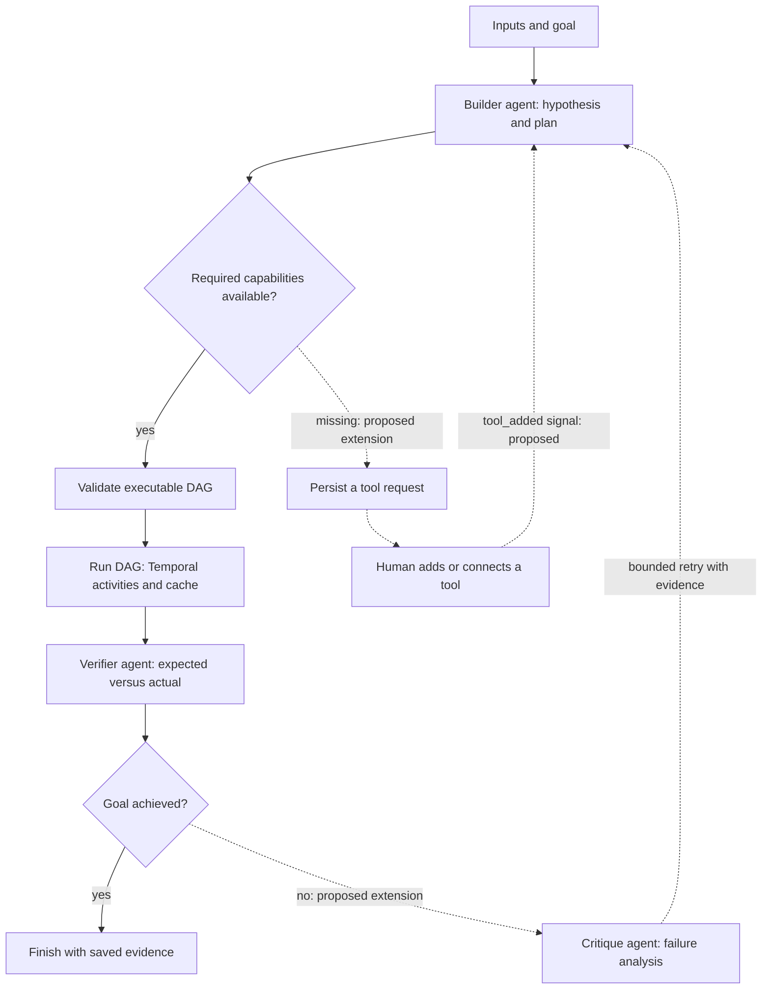
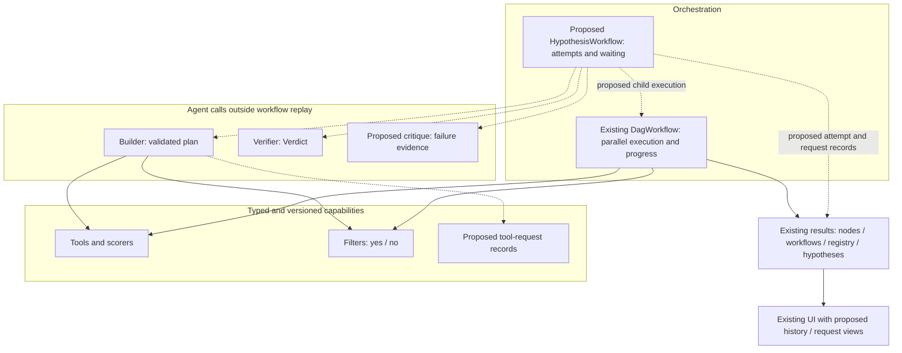

# Intended structure: a working sketch

This describes the two supplied WhatsApp diagrams, checked against `main` at
`f9d2f50`. It is a design to discuss and revise as we experiment. Component names
and proposed paths below are suggestions; this documentation does not implement
the missing pieces.

The basic idea is to give an agent a goal and inputs, let it compose a plan from
typed tools, execute that plan reproducibly, then compare the result with the
goal. A failed attempt supplies evidence for a revised plan. If an essential tool
is missing, the system can record the need and wait for a human to supply it.

## The intended hypothesis loop

The uninterrupted builder → validated DAG → execution → verifier path exists
today. The availability/request/wait branch, critique and retry arrows are
proposed. Successful and unsuccessful attempts should both retain their evidence;
saving only the successful endpoint would conceal failures and costs.

In today's implementation, `run_hypothesis` saves stages in a Python async
function and calls `Client.execute_workflow` for a top-level `DagWorkflow`. It
returns after one verifier result, including a negative result. There is no
durable `HypothesisWorkflow`, missing-tool signal handler or critique loop yet.

## Responsibilities and current status

| Layer | Intended responsibility | What exists today / what would change |
| --- | --- | --- |
| Hypothesis orchestration | Own attempts, budgets, waiting, retry history and completion | `temporal/run_hypothesis.py` coordinates one attempt. A proposed Temporal `HypothesisWorkflow` could make the longer loop durable. |
| DAG execution | Run ready steps in parallel, cache node results, expose progress and persist outcomes | `temporal/dag/workflow.py` and `activities.py` implement this. A future hypothesis workflow could invoke it as a child workflow. |
| Builder | Inspect available capabilities, reuse configurations, explain and submit a plan | `build_agent` in `src/node_dag/agent.py` does this for known nodes. Its current output tool is `submit_dag`; the diagram's `submit_plan` is a possible broader contract. |
| Verifier | Compare expected and actual outcomes independently of the builder's explanation | `verify_agent` returns `Verdict(achieved, reason)`. Keep a quantitative research evaluator separate. |
| Critique | Explain why an attempt failed and what a revised attempt should test | Proposed. It should use the actual outcome, validation errors and previous attempts rather than simply repeat the builder's story. |
| Node library | Offer typed, versioned tools, scorers and decisions | Manual `NodeConfig`/`MAPPING` registration exists. "Decisions" currently means score filters producing `.yes`/`.no`, rather than arbitrary workflow control. |
| Tool requests | Describe a missing capability and track human resolution | Proposed. A request is a durable record, not an executable placeholder node. |
| Evidence and UI | Show plans, attempts, tool requests, progress, outcomes and verdicts | Local `results/` and the existing FastAPI/HTML UI cover nodes, workflows, registry and hypotheses. Request and attempt-history views would be additions. |

These are responsibilities, not a requirement for three separate LLM services.
The builder and verifier are already agent factories in one module. A critique
can begin as another typed result in that same module; separate it when the
implementation becomes easier to understand that way.

## How the layers fit together

Keep model calls, external computation and file writes in activities or other
code outside Temporal workflow replay. The orchestration layer decides when to
run or wait; the agent proposes what to try; typed validation decides whether a
plan is executable; node code performs the operation. Preserve that separation
if the Python coordinator later becomes a Temporal workflow.

## Local tools, remote tools and missing tools

The diagram's "best tools, local or not" is a useful capability view. The current
library contains local Python implementations, and there is no general remote
tool connector. A remote operation could be wrapped as a normal typed node rather
than introducing a second kind of DAG. Before doing so, specify its input/output
schema, service/model version, context, cost, timeout and failure behaviour.
Cacheability depends on reproducibility: a changing remote service may need a
version or a snapshot instead of the same cache promise as a deterministic node.

For a missing capability, a proposed `ToolRequest` would record the hypothesis
and attempt IDs, expected ports and outputs, why existing tools are insufficient,
acceptance examples and resolution status. A human can implement a node or connect
an available service, validate/register it and resolve the request. A
`tool_added` signal should identify that request and the usable tool version.
Reinspect the library and rebuild the executable DAG after resolution; the signal
alone is not proof that the original plan is now valid. Manual registration and
the module-level builder catalogue may require a worker restart before a newly
added implementation is available.

Whether this wait belongs in a durable Temporal workflow or a simpler persisted
Python coordinator remains a design choice. Temporal fits long waits and restart
recovery; a Python loop is quicker to explore. Use the same attempt/request
records either way. Handle duplicate or late resolution signals idempotently,
and give waiting/cancellation an explicit state rather than busy polling.

Human-added tools and model-authored tools are alternative ways of satisfying a
request. The supplied diagram sketches the human route. The work breakdown adds
autonomous authoring as a possible research direction, which brings a separate
isolation and validation requirement. Neither route should be assumed mandatory.

## Two loops with different purposes

| Loop | Unit of improvement | Evidence used | Completion |
| --- | --- | --- | --- |
| Hypothesis loop in the diagrams | A plan for a particular goal and inputs | Validation failures, executed outputs, verifier result, critique and available tools | Goal achieved, budget exhausted, explicit cancellation or a recorded unresolved dependency |
| Recoding research loop in the proposal | A reusable design algorithm, represented by a DAG and possibly authored nodes | Per-gene development metrics, hard constraints, paired comparisons, baselines and lineage | Frozen algorithm evaluated under the independent confirmation protocol |

A successful hypothesis is not automatically a selected research improvement.
The verifier may establish that a requested transformation occurred; the benchmark
must establish how well the algorithm performs across a fixed set of genes.
Research selection and held-out access belong to an outer evaluator, which the
candidate cannot change. A request for an unavailable tool is an operational
dependency rather than a biological hypothesis being refuted.

Also distinguish three retry mechanisms: the builder's existing bounded
`ModelRetry` corrects invalid submissions; Temporal can retry failed activities;
the proposed critique loop changes the hypothesis after an executed attempt.
Give each an explicit budget and record the costs so nested retries cannot become
an unbounded search.

## Possible file ownership as the design grows

| Responsibility | Existing home or proposed extension |
| --- | --- |
| Hypothesis, plan and agent outputs | Extend `src/node_dag/agent.py`; keep today's serialized records readable or explicitly migrate them. |
| Durable hypothesis loop, if chosen | A proposed module under `temporal/`, alongside the existing DAG workflow. |
| Node implementations and contracts | Existing `src/node_dag/nodes/`, `factory.py` and `registry.py`. |
| Request and attempt persistence | Extend the existing atomic-storage pattern; proposed `results/requests/` and explicit attempt records. |
| Research population and selection | Proposed `src/node_dag/search/`, separate from per-hypothesis execution. |
| Instances, metrics, baselines and statistics | Proposed evaluation modules and versioned instance manifests; keep hidden data inaccessible to candidates. |
| Explanation and inspection | Extend `temporal/ui/`; keep saved evidence as the source for displayed claims. |

Do not scaffold all these directories now. First decide which loop we are trying
to demonstrate, then close one useful cycle with persisted evidence. The next
small architectural experiment could be a bounded critique-and-retry loop using
existing tools. Durable tool requests are a separate addition when human waits
become part of the demonstration. For the biological claim, prioritise the fixed
benchmark and outer comparison described in
[research-directions.md](research-directions.md).

## Open design questions

- Does a tool request pause one hypothesis while other research candidates proceed,
  or pause the entire run? What budget and cancellation rule applies during waits?
- Should critique and verification use separate models, prompts or roles? What
  independent evidence would show that the added critique step improves selection?
- Which execution failures justify rerunning the same plan, and which should return
  to the builder as a capability or design problem?
- Is the first demonstration human-assisted tool growth, autonomous code authoring,
  or search over a fixed library? Each makes a different claim about autonomy.
- When is Temporal durability valuable enough to move the outer coordinator, and
  when is a local evaluator preferable for many short benchmark runs?

Source sketches: `WhatsApp Image 2026-10-03 at 14.13.01 (1).jpeg` (hypothesis
flow) and `WhatsApp Image 2026-10-03 at 14.13.01.jpeg` (layers), supplied alongside
the request. Their labels describe intent; current behaviour is established by
the implementation referenced above.
